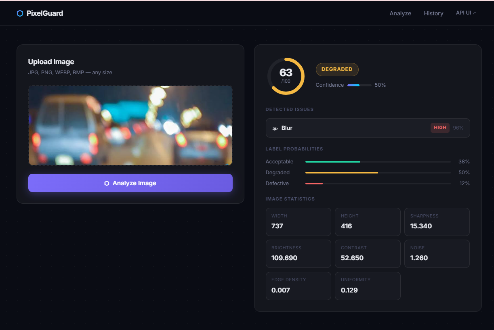
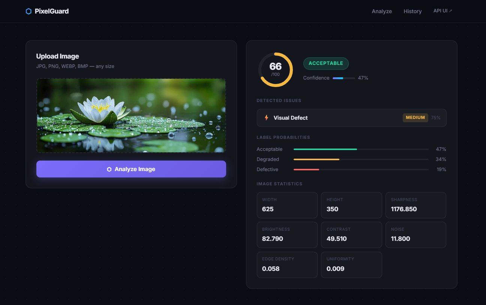
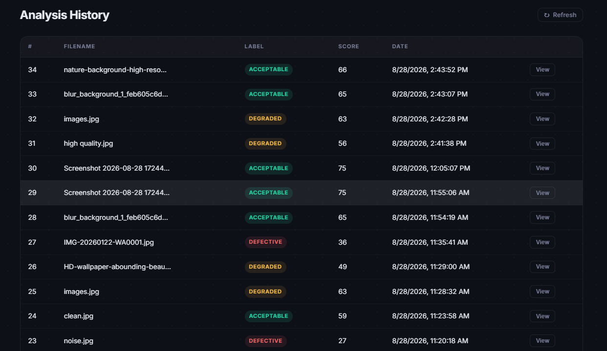

# PixelGuard — AI-Powered Image Quality & Defect Detection

🔗 **Live Demo**: https://image-quality-detector.onrender.com/

> **Note**: Hosted on Render's free tier — the first load after a period of
> inactivity may take 20–30s for the server to wake up, and can briefly
> show unstyled content while assets finish loading. A quick page refresh
> resolves it. This is a free-tier cold-start limitation, not an
> application bug.

Full-stack application that accepts an image, analyzes it for quality issues
(blur, under/overexposure, noise, corruption, visual defects), and returns a
structured JSON result — with a polished React UI and a Gradio fallback UI.

No external AI/vision APIs are used. All inference runs on locally trained
scikit-learn models using engineered OpenCV features (satisfies assessment
requirement: "External AI services: Not permitted").

---

## 1. Problem Statement (assessment §1)

Given an uploaded image, the system evaluates visual quality and classifies
it as **ACCEPTABLE**, **DEGRADED**, or **DEFECTIVE**, while identifying the
specific issue(s) present.

## 2. Detected Issue Types (assessment §2)

| Required issue | Implemented as |
|---|---|
| Blur / insufficient sharpness | `blur` — Laplacian variance |
| Underexposure | `underexposure` — brightness histogram |
| Overexposure | `overexposure` — brightness histogram |
| Image noise | `noise` — median-blur residual |
| Image corruption / severe degradation | `corruption` — block-uniformity + neighbor-jump heuristic |
| Potential visual defect | `visual_defect` — a dedicated seventh class in the issue-type classifier, trained on simulated scratch lines and tinted regions (lens-flare / watermark-style artifacts), distinct from `corruption` |

### Screenshots

**Blur detection**


**Visual defect detection**


**Analysis history**


## 3. AI / Computer Vision Approach (assessment §3)

**Hybrid: engineered CV features + Random Forest ensemble** — explicitly one
of the assessment's listed acceptable approaches ("a hybrid approach
combining image-quality features with a learned model").

10 interpretable features are computed per image using OpenCV:

| Feature | Signal |
|---|---|
| `sharpness` | Laplacian variance — low = blurry |
| `mean_brightness` | Mean pixel value — low = underexposed |
| `dark_pixel_fraction` | Fraction of near-black pixels |
| `bright_pixel_fraction` | Fraction of near-white pixels |
| `contrast` | Std dev of pixel intensities |
| `noise` | Median-blur residual std — high = noisy |
| `mean_saturation` | HSV saturation — low = washed out |
| `std_saturation` | Saturation spread |
| `edge_density` | Canny edge fraction |
| `block_uniformity` | Fraction of blocks that are internally uniform AND abruptly different from neighboring blocks (corruption/defect heuristic) |

These features feed **three separate Random Forest models**:

1. `quality_label_clf` → ACCEPTABLE / DEGRADED / DEFECTIVE
2. `quality_score_reg` → continuous 0–100 score
3. `issue_type_clf` → blur / underexposure / overexposure / noise / corruption / visual_defect / clean (7 classes)

**Why Random Forest over a raw CNN:** the input is a 10-dimensional
engineered feature vector rather than raw pixels; the feature→quality
relationship is non-linear but low-dimensional, which is a strong fit for
tree ensembles; training is fast enough to iterate within the assessment
window; and `feature_importances_` gives per-prediction explainability for
free (see §10 below), without needing Grad-CAM or a saliency-map pipeline.

## 4. Image Analysis (assessment §4)

Sharpness, brightness/exposure, contrast, noise, saturation, and edge
density are all explicitly computed and returned in every API response
under `image_stats`, so the reasoning behind each decision is visible, not
just a final label.

## 5. Backend (assessment §5)

FastAPI REST API (`backend/app.py`):

- `POST /analyze` — multipart image upload, returns structured JSON
- `GET /history?limit=50` — retrieve previous analyses
- `GET /history/{id}` — retrieve one specific analysis
- `GET /health` — service health check
- `GET /metrics` — live model evaluation metrics
- Invalid/non-image files → HTTP 400
- Unreadable/corrupted files → HTTP 422 with a clear error message
- Unexpected errors → HTTP 500 with detail
- Results persisted in **SQLite** (`backend/db.py`)

## 6. Frontend (assessment §6)

Two frontends are included:

1. **PixelGuard** (primary) — a custom React UI (`frontend/`) built with
   Antigravity, live-connected to the FastAPI backend. Shows the uploaded
   image, a circular quality-score gauge, the quality label, detected
   issues with severity/confidence, per-class label probabilities, and a
   full image-statistics breakdown. Includes an **Analyze** view and a
   **History** view. Handles loading, success, and error states.
2. **Gradio UI** (fallback, mounted at the backend's `/gradio` route) —
   simpler, zero-build alternative for quick local testing; also supports
   upload, results display, and history.

## 7. API Response Format (assessment §7)

```json
{
  "quality_score": 82,
  "quality_label": "ACCEPTABLE",
  "issues": [{"type": "noise", "severity": "low", "confidence": 0.71}],
  "confidence": 0.88,
  "label_probabilities": {"ACCEPTABLE": 0.88, "DEGRADED": 0.1, "DEFECTIVE": 0.02},
  "image_stats": {"width": 640, "height": 480, "sharpness": 312.4, "...": "..."},
  "id": 17
}
```

## 8. Dataset and Training (assessment §8)

**Synthetic degradation** was used, as explicitly permitted by the
assessment: "Applicants may... generate controlled image-quality
degradations from clean images. If synthetic degradation is used, describe
how training and evaluation data were generated."

- **Base clean images**: a sample from the [Intel Image Classification
  dataset](https://www.kaggle.com/datasets/puneet6060/intel-image-classification)
  (natural scenes: buildings, forest, glacier, mountain, sea, street).
- **Degradation pipeline** (`backend/degrade.py`): Gaussian blur,
  brightness scaling (under/overexposure), Gaussian noise, low-quality
  JPEG re-encoding + blacked-out blocks (corruption), and simulated
  scratch lines / tinted regions (visual defect), each at multiple
  severity levels, plus untouched "clean" samples. Ground-truth labels
  are known exactly because we control the degradation applied.
- **Dataset build**: `backend/build_dataset.py` turns a folder of clean
  images into a labeled feature CSV, used to train the three models
  currently in `models/`.
- **Train/test split**: 80/20, stratified by `quality_label`.

## 9. Evaluation (assessment §9)

Full metrics (accuracy, macro-F1, confusion matrix, per-class
precision/recall, feature importances) are in `models/metrics.json`,
generated by `backend/train_model.py`, and also served live at
`GET /metrics`. A fully worked write-up — including per-class breakdowns,
feature importances, and a discussion of failure cases — is in
`notebooks/evaluate_generalization.md`.

**Held-out synthetic test set (20% split, 120 samples):**

| Model | Accuracy | Macro-F1 |
|---|---|---|
| Quality label (ACCEPTABLE/DEGRADED/DEFECTIVE) | 86.7% | 0.86 |
| Issue type (blur/exposure/noise/corruption/visual_defect/clean) | 88.3% | 0.89 |
| Quality score regressor | MAE ≈ 7.9 pts | — |

**Known failure cases / limitations** (full detail in
`notebooks/evaluate_generalization.md`; summarized here):

- **Blur vs. underexposure confusion**: very dark but genuinely sharp
  images (e.g. textured night scenes) can reduce the Laplacian-variance
  sharpness signal enough to be mistaken for blur.
- **Synthetic vs. real noise distribution**: training uses synthetic
  Gaussian noise; real camera sensor noise (shot/read/fixed-pattern noise)
  has a different statistical structure, so real-world noise detection may
  be less reliable than the synthetic-test-set numbers suggest.
- **`visual_defect` generalization**: this class is trained on simulated
  scratches and tinted regions; real-world defects (dead sensor pixels,
  chromatic aberration, physical lens scratches) may not trigger it
  reliably, since "visual defect" is an inherently open-ended category.
- **Compression artifacts vs. corruption**: heavily JPEG-compressed but
  otherwise legitimate images share blocky-artifact and low-edge-density
  characteristics with `corruption`, and can be misclassified.
- **No dedicated real-photo evaluation set**: all current evaluation is on
  a held-out split of the *synthetic* dataset. Real-image generalization
  (e.g. against the [Kaggle Blur
  Dataset](https://www.kaggle.com/datasets/kwentar/blur-dataset)) was
  explored during development but is not yet part of the committed
  evaluation artifacts — see "Improvement Directions" in
  `notebooks/evaluate_generalization.md`.
- Confidence values from `predict_proba()` are raw Random Forest posterior
  estimates and are not calibrated (tend to be overconfident).

## 10. Explainability (assessment §10)

Every `/analyze` response includes:

- Raw `image_stats` (sharpness, brightness, noise, etc.) — the actual
  signals the decision was based on, not just a black-box score.
- Per-class `label_probabilities` and per-issue `confidence` from the
  Random Forest's probability outputs.
- `models/metrics.json` (also served live at `GET /metrics`) includes
  `feature_importances_` per model, showing which engineered features
  matter most for each prediction type — see `notebooks/evaluate_generalization.md`
  for the full interpreted table (e.g. `sharpness` and `noise` are the
  most discriminative features for the quality-label classifier).

## 11. Deployment (assessment §11)

- `Dockerfile` + `docker-compose.yml` provided; the backend listens on
  port `7860` (configurable via the `PORT` env var).
- `GET /health` — service/status check endpoint.
- Model loading: the three `.joblib` files (`models/quality_label_clf.joblib`,
  `quality_score_reg.joblib`, `issue_type_clf.joblib`) are lazy-loaded on
  first inference call (see `backend/inference.py`) and reused for
  subsequent requests.
- Local Docker Compose: `docker compose up --build` → `http://localhost:7860`
- **Deployed URL**: https://image-quality-detector.onrender.com/

### Local setup (without Docker)

```bash
# Backend
cd backend
python -m venv .venv
.venv\Scripts\Activate.ps1        # Windows PowerShell
# source .venv/bin/activate       # macOS/Linux
pip install -r requirements.txt
python app.py
# -> REST API + Gradio UI at http://localhost:7860

# Frontend (PixelGuard, React)
cd frontend
npm install
npm run dev
```

### Docker

```bash
docker compose up --build
# -> http://localhost:7860
```

## 12. Submission Contents (assessment §12)

- Full source: `backend/` (API, ML, DB), `frontend/` (React UI),
  `models/` (trained artifacts + metrics), `notebooks/` (training notebook
  + generalization/evaluation report), `tests/` (automated tests)
- This README: setup, model/training, API, deployment, DB instructions
- `backend/db.py`: SQLite schema, auto-initialized on startup
- API docs: see §7 above and the auto-generated OpenAPI docs at
  `/docs` when the backend is running
- Evaluation results: `models/metrics.json` +
  `notebooks/evaluate_generalization.md`
- Sample images: `data/samples/` (clean, blur, noise, over/underexposure,
  corruption, and visual-defect examples)
- `Dockerfile` + `docker-compose.yml`
- **Deployed URL**: https://image-quality-detector.onrender.com/

## 13. Optional / Bonus Work (assessment §13)

- **Automated tests** (`tests/`) — `test_api.py`, `test_features.py`,
  `test_inference.py` covering API endpoints, feature extraction, and
  model inference.
- Two independent frontends (React + Gradio).
- Confidence values surfaced per-issue and per-label throughout, plus a
  live `/metrics` endpoint exposing evaluation results without needing to
  read the repo.

## Project Structure

```
backend/
  features.py       — engineered CV feature extraction
  degrade.py         — synthetic degradation generator
  build_dataset.py   — builds labeled CSV from a folder of clean images
  train_model.py      — trains + evaluates the RF models, writes metrics.json
  inference.py         — loads trained models, runs analysis on a new image
  db.py                — SQLite persistence
  app.py                — FastAPI REST API + Gradio UI (single process)
frontend/               — PixelGuard React UI
models/                  — trained model artifacts (.joblib) + metrics.json
data/
  raw/                   — clean source images (build_dataset.py input)
  synthetic/             — generated labeled dataset CSV
  samples/               — representative sample images (one per issue type)
notebooks/               — training notebook + evaluate_generalization.md
tests/                   — automated backend tests (pytest)
Dockerfile
docker-compose.yml
```

## Environment Variables

- `PORT` — port the backend listens on (default `7860`, required by most
  container hosts including Render/Hugging Face Spaces).
